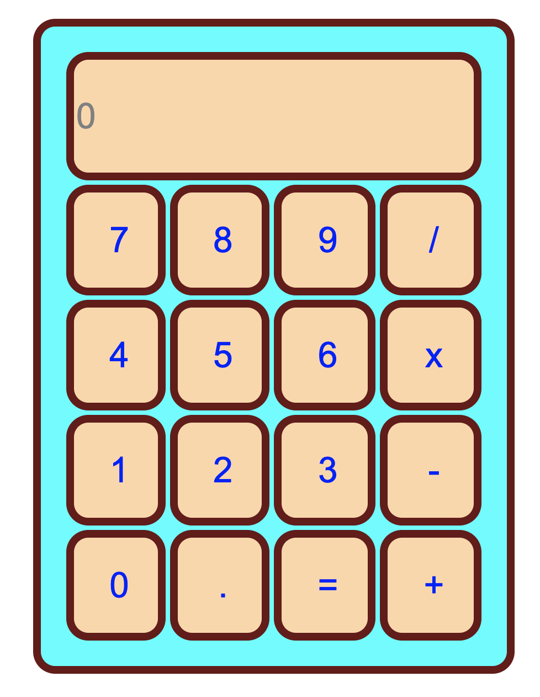

### HTML + CSS
**Page**:

<picture>
  
</picture>

### Javasript
**Calculator**:

<picture>
  
</picture>

**Yêu cầu**: bài tập này chủ yếu thực hành một chút CSS và phần binding và handle event trong JS. Ko đánh đố thuật toán gì, chỉ cần khi click button thì text nó sẽ hiện lên màn hình số, cuối cùng khi click button `=` thì dùng method [eval](https://developer.mozilla.org/en-US/docs/Web/JavaScript/Reference/Global_Objects/eval) trong JS để thực thi expression mà mình đã hiển thị.
